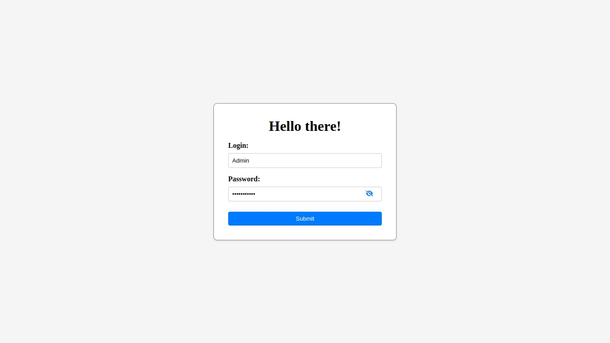

# LOG IN PAGE

## :rocket: ***Let's Register some users!***

#### - :books: Contents:

This repository has:
- 
Html
 file to structure things.
- 
Css
 file to style.
- 
Javascript
 to just display and hipe password.
- 
NodeJs
 to make a live server.

#### How set it up:

ON THE CLONNED DIRECTORY

First check if you have npm installed:

  npm --v

Second install the NodeJs framework Express:

  npm install express

Third to get things running:

  node app.js

Fourth go to a browser and search:

  127.0.0.1:3000

:pushpin: __NOTE:__ 
This was made for a university assignment.

